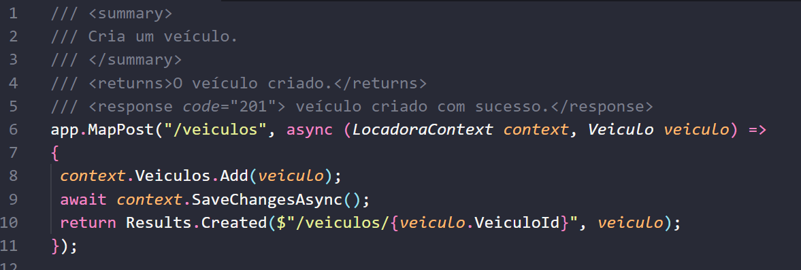
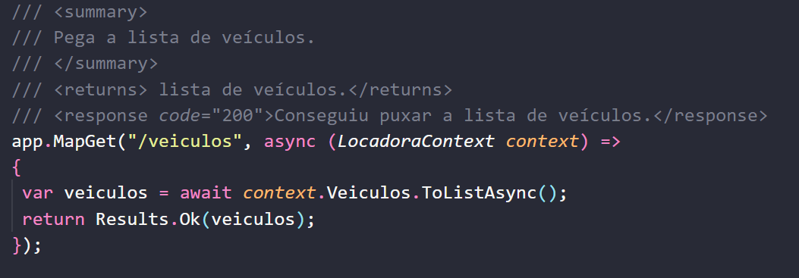
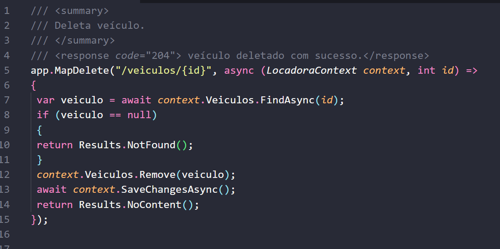

# Relatório de Funcionamento do Sistema de Locadora de Veículos

## 1. Introdução
Neste relatório, pretendo detalhar as etapas percorridas no desenvolvimento do sistema para uma locadora de veículos. Por se tratar de um sistema para uma locadora, os principais atores envolvidos são carros, clientes e reservas. Quanto ao uso de tecnologias, foi feito o uso de: C#, ASP.NET Core, Entity Framework e Swagger para desenvolver e testar este sistema. A seguir, seguem os detalhamentos das atividades em maior detalhe, começando pelo levantamento de requisitos.

## 2. Requisitos Funcionais
Para o desenvolvimento deste sistema, foram levantados requisitos funcionais que cobriam todas as operações de uma locadora de veículos. Usei como exemplo as operações da Localiza, onde já aluguei um carro e estava um pouco familiarizado com o processo. Em primeiro lugar, o sistema deve incluir requisitos de cadastro e gerenciamento de veículos, devendo serem criadas opções: adicionar, editar, excluir e consultar os detalhes do veículo. Para clientes, o sistema deve incluir opções de cadastro e registro em que seja possível controlar uma reserva e histórico de locação do cliente. O sistema também deve permitir criar e gerenciar uma reserva de clientes.

## 3. Arquitetura do Sistema
A arquitetura adotada para o desenvolvimento deste sistema foi o modelo MVC (Model-View-Controller), seguindo o enunciado do projeto. Essa arquitetura caracteriza-se por separar a lógica de negócios da interface de usuário, facilitando manutenções e atualizações futuras. O modelo (Model) contém as definições de dados e a lógica de negócios, o controlador (Controller) processa as interações do usuário, enquanto a view está encarregado de apresentar os dados visualmente, como o nome já sugere. Além disso, foi feito também o uso de API RESTful, que facilita a comunicação entre o frontend e o backend e suporta integrações com outros sistemas, potencializando a escalabilidade do sistema.

## 4. Implementação Técnica
Na implementação técnica, seguindo as diretrizes da disciplina, foi feito uso de ASP.NET Core para a construção da API, garantindo alta performance e compatibilidade com diversas plataformas. O Entity Framework foi utilizado para o mapeamento objeto-relacional, simplificando o acesso e a manipulação dos dados armazenados no SQL Server. A documentação da API foi gerada usando Swagger, proporcionando uma interface interativa para testes e validação das requisições HTTP. Por fim, o código foi estruturado em classes seguindo os princípios SOLID para uma maior manutenibilidade e escalabilidade.

## 5. Descrição do Banco de Dados
O banco de dados do sistema foi estruturado com tabelas para veículos, clientes, reservas e transações. O relacionamento entre essas tabelas foi definido a fim de garantir integridade referencial e otimizar as operações de consulta. Além disso, foram implementadas também as operações CRUD básicas e consultas SQL.

## 6. Testes e Validação
A fase de testes e validação do software incluiu uma combinação de testes manuais e automatizados para cobrir os diferentes aspectos do sistema.

### 6.1 Testes Manuais

#### 6.1.1 Testes de API com Swagger
Para estes, utilizei o Swagger, seguindo as diretrizes da disciplina e também a fim de simplificar a documentação e a interação com as APIs RESTful. Através da interface do Swagger, testei todos os endpoints, incluindo o cadastro, a atualização, a exclusão e a consulta de veículos, clientes e reservas. Os testes provaram que os endpoints estavam respondendo conforme o esperado. Por exemplo, ao enviar uma solicitação POST para criar um novo veículo, a resposta era um código 201 (Created) indicando sucesso, e o objeto criado era retornado corretamente. As solicitações GET retornaram a lista de veículos e clientes corretamente, enquanto as solicitações PUT e DELETE atualizaram e excluíram os registros conforme esperado.

#### 6.1.2 Testes de Funcionalidade com Postman
Já para testes de funcionalidade, por sua natureza mais extensiva, utilizei o Postman, a fim de conduzir testes que contemplassem cenários de uso comuns e casos de borda. Por exemplo, após testar a criação de reservas para veículos que já estavam reservados, o sistema respondia corretamente com um código 400 (Bad Request). Foram feitos também outros testes envolvendo cadastro de veículos com dados inválidos, como placas duplicadas, para verificar se o sistema lidava com esses casos corretamente.

### 6.2 Testes Automatizados

#### 6.2.1 Testes Unitários com xUnit
Para a parte de testes automatizados, utilizei o framework xUnit para escrever testes unitários. Para isso, criei um arquivo de teste chamado `UnitTest1.cs`, contendo testes que validaram o comportamento dos endpoints do sistema. Por exemplo, o teste `Get_Veiculos_ReturnsSuccessStatusCode` verificou que o endpoint `/veiculos` retornava um código de status 200 (OK), indicando que a lista de veículos foi recuperada com sucesso.

### 6.3 Resultados dos Testes
No geral, a cobertura de testes foi satisfatória e dentro daquilo que esperava para o software, cobrindo os principais cenários de uso do sistema. A eficácia dos testes foi avaliada levando em consideração a capacidade do sistema de responder corretamente a solicitações válidas e inválidas. Durante os testes, alguns problemas menores foram encontrados, como a falta de validação adequada em alguns campos, mas esses foram resolvidos.

## 7. Resultados e Conclusões
Após a conclusão da etapa de testes e validações, foi possível verificar que o software desenvolvido atendeu aos requisitos estabelecidos, demonstrando lidar conforme esperado em cenários de cadastro, atualização, exclusão e consulta de veículos, clientes e reservas.

### 7.1 Conformidade dos Requisitos
Os requisitos funcionais foram atendidos, incluindo funcionalidades como cadastro de veículos, clientes e reservas. Além disso, as funcionalidades de API estavam bem documentadas e facilmente acessíveis através do Swagger.

### 7.2 Eficácia do Sistema
O sistema foi eficaz em atender às necessidades de uma locadora de veículos. Os testes realizados com Swagger, Postman e xUnit indicaram que o sistema é capaz de lidar com os diferentes casos de uso. A eficácia do sistema foi ainda mais evidente nos casos de borda testados, onde o sistema respondeu de forma adequada a dados inválidos e a cenários inesperados.

### 7.3 Conclusões
Em conclusão, o software desenvolvido atendeu seu objetivo de fornecer uma solução eficaz para o gerenciamento de veículos, clientes e reservas. O sistema não só atendeu aos requisitos funcionais, mas também demonstrou ser capaz de lidar com diferentes cenários de uso e de se adaptar a mudanças futuras.

## 8. Considerações Finais
Através do processo de prática investigativa e de desenvolvimento passado ao realizar este processo, fui capaz de aplicar técnicas modernas de desenvolvimento em um projeto real. Ao ter concluído o projeto, vejo com mais clareza a importância de uma boa arquitetura inicial e práticas de desenvolvimento positivas.

## 9. Referências
Durante a elaboração do projeto, acabei tendo que consultar a documentação oficial de tecnologias como ASP.NET Core, Entity Framework, e as APIs. Seguem algumas destas referências:

1. Microsoft. Introdução ao ASP.NET Core. Disponível em: [link](https://learn.microsoft.com/en-us/aspnet/core/introduction). Acesso em: 2024.
2. Microsoft. API Web do ASP.NET Core. Disponível em: [link](https://learn.microsoft.com/en-us/aspnet/core/web-api). Acesso em: 2024.
3. Microsoft. Visão geral do Entity Framework. Disponível em: [link](https://learn.microsoft.com/en-us/ef/). Acesso em: 2024.
4. Swagger. Especificação OpenAPI. Disponível em: [link](https://swagger.io/specification/). Acesso em: 2024.
5. Xunit. Introdução ao xUnit.net para .NET Core. Disponível em: [link](https://xunit.net/docs/getting-started/netcore/cmdline). Acesso em: 2024.

## 10. Apêndices

### A. Código Fonte

#### A.1. Criação de Veículo

#### A.2. Consulta de Veículos

#### A.3. Deleção de Veículo

### B. Consultas SQL

#### B.1. Consulta de Reservas por Cliente

SELECT * FROM Reservas
WHERE ClienteId = @ClienteId;

#### B.2. Inserção de Cliente

INSERT INTO Clientes (Nome, CPF)
VALUES ('John Doe', '123.456.789-10');

#### B.3. Atualizar status de um veículo

UPDATE Veiculos
SET Status = 'Alugado'
WHERE VeiculoId = 1;

#### C. Diagrama de Classe

